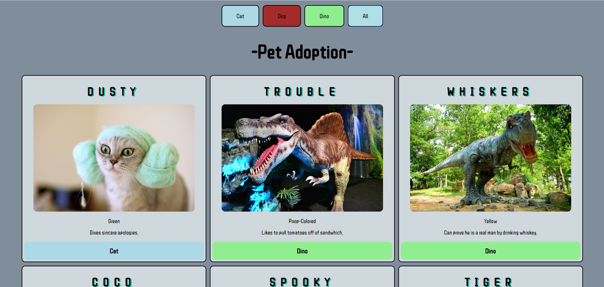

# pet-adoption readme

## Description
This project is an exploration into filtering content that displays on the page. 
We used bootstrap cards and buttons. You can click the button at the top of the string, and it will display by animal type.

## Screenshots

## How to run
1. Clone down this repo
1. Make ure you have http-server installed via npm. If not get it [here](https://www.npmjs.com/package/http-server)
1. On your command line, run `hs -p 9999`
1. In your browser go to `http://localhost:8080`
